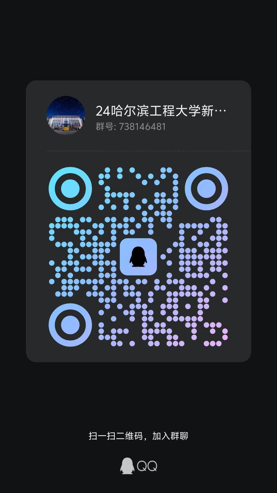

# **信息渠道**
 暑假在家的新生们不认识学长学姐，没有办法打听学校的信息怎么办？父母不了解学校的环境怎么办？
 不要着急，现在我们就列出三个比较大的信息渠道，让大家在手机上也可以提前了解学校！下面将为你们一一介绍~

## **工学小口袋**
 工学小口袋致力于为HEU的学生们提供各种实用功能：免费的学习资料、考研保研就业留学等经验分享、最新的校园通知、吃喝玩乐、假期旅游、商家优惠等诸多内容，是工程学子的必备。
 请在微信公众号搜索【工学小口袋】关注。

## **赞噢校园集市**
 赞噢校园集市是目前校园二手买卖、打听求助、恋爱交友、兼职招聘的最大平台。倘若想进行讨论吃瓜，可移步至此发帖。
 请在微信小程序搜索【赞噢校园集市】关注注册使用。

## **新生群**
 新生群是新生们互相认识，结交学长学姐的大群聊！当然里面也会有各种各样的广告，请谨慎识别。
 请查询QQ群号(738146481)或扫描以下二维码入群。  

  