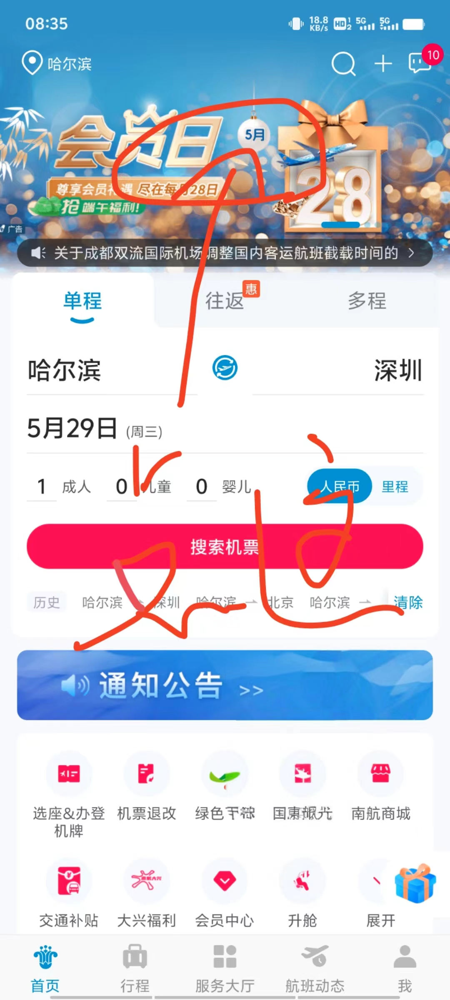
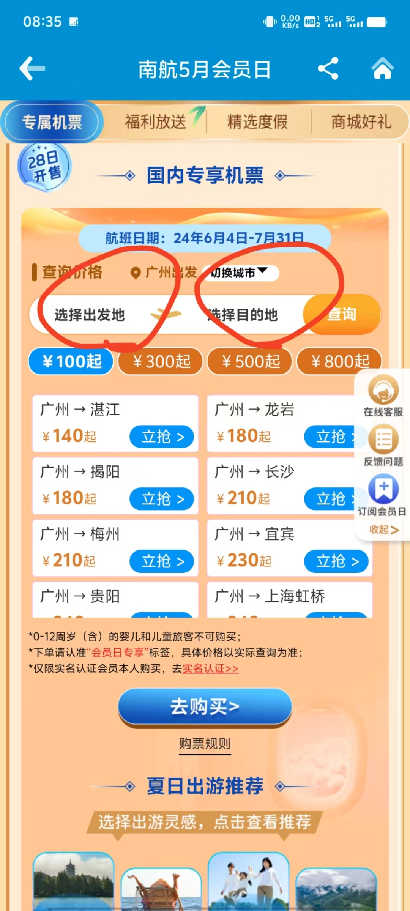
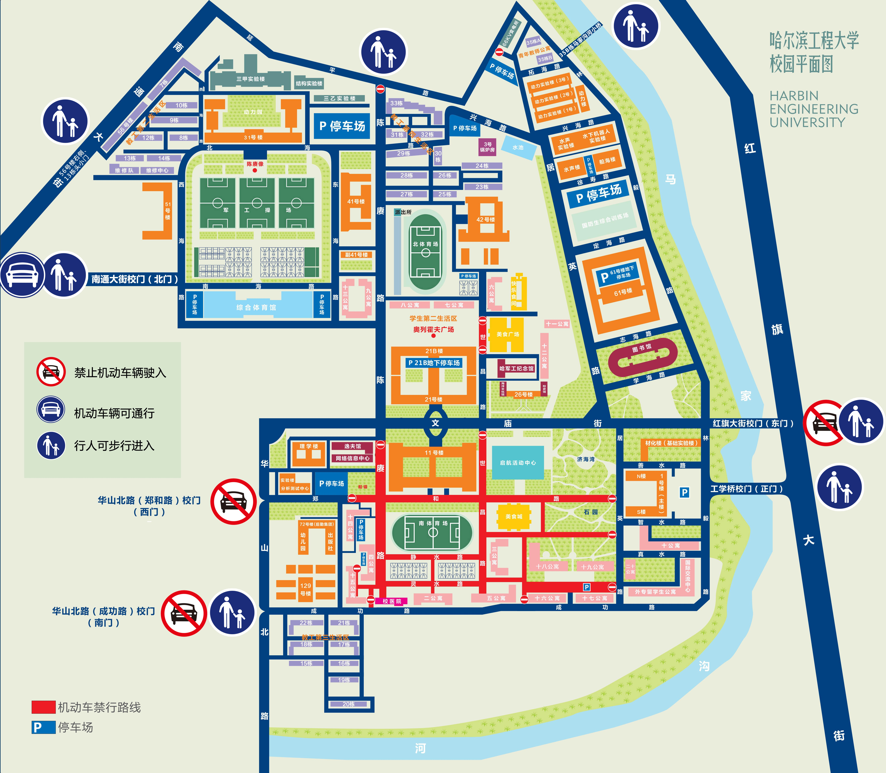
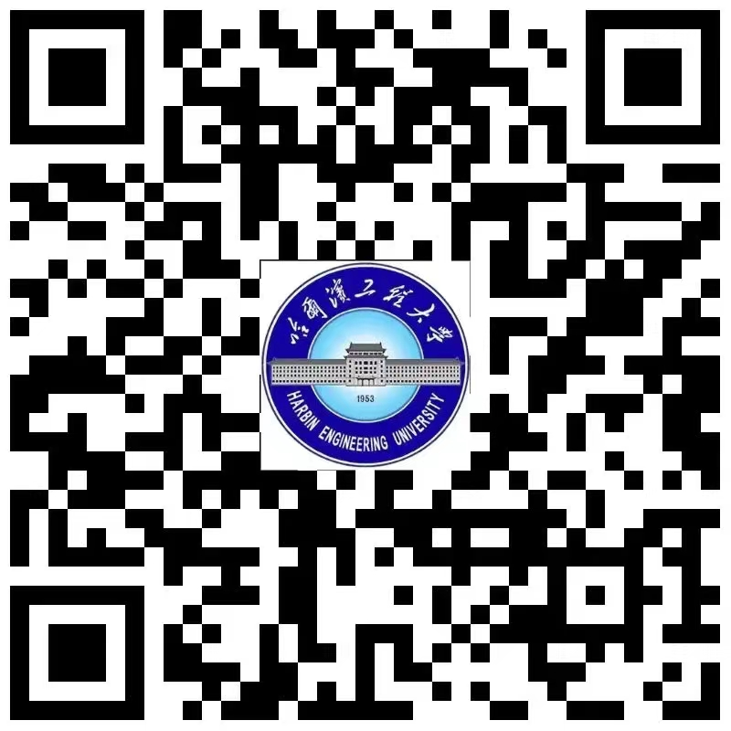
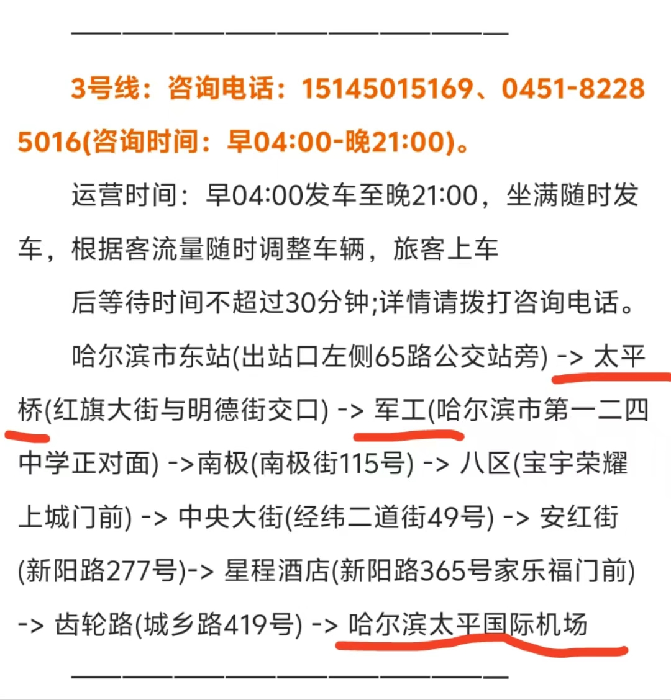

# **交通**
 在即将启程的大学之旅中，交通无疑是连接家与校园、校园内外的重要纽带。
 为了让这段旅程更加经济实惠，交通篇将按照家->学校->校园->校园内部的顺序，逐一展开详细讲述。

 每一位新生都希望能够在交通上做到既经济又高效。因此，这一篇章旨在帮助大家在交通上做出明智的选择，节省宝贵的资金，让你们能够将更多的精力和资源投入到学习和生活中。

## **机票优惠**
 面对机票价格的高昂，许多新生可能会感到困惑和无奈。
 但别担心，这里有一条省钱的捷径。

 每个月的28号，南方航空都会推出下个月的特价机票，这些机票不仅价格优惠，而且服务同样优质。
 以我个人的经历为例，从哈尔滨飞往广州的机票，有时甚至只需640元，这无疑是一个令人心动的优惠。

 为了让大家都能享受到这样的优惠，我整理了购买的方法。
 在开始之前，请确保你已经下载并安装了南方航空的官方APP，这将是你获取优惠信息和完成购票的重要工具。

 接下来，请跟随以下图片的步骤，一步步解锁购买打折机票的秘诀。

 <!-- 设置两张图片并排显示，并设置间距 -->
 
 
     
    
 

## **公交地铁**
 在外出时，乘坐公交和地铁是不可避免的。如今只需一部手机，就能轻松通行。

 公交和地铁都可以通过手机支付。具体步骤如下：

 打开微信->
 点击 “我”->
 选择 “服务”->
 进入 “城市服务”->
 定位到哈尔滨->
 在热门专题中选择 “出行”->
 打开公交地铁乘车码，过关时扫码即可

## **出租车**
 警惕黑车！警惕黑车！警惕黑车！ 重要的事情值得重复三遍。无数学长学姐们在这个问题上吃过亏，每当回忆起那些不必要的损失，他们总是懊悔不已，痛心疾首。那么，我们该如何避免重蹈覆辙，识别并远离黑车呢？

 目的地是学校时： 请注意，这是许多学长学姐在哈尔滨的第一课。请牢记，那些出站后热情洋溢地称呼你为帅哥或美女的，基本上就是黑车司机！（别让甜言蜜语蒙蔽了你的双眼。）我们应该选择去正规的打车点，乘坐打表的出租车（可以向工作人员询问哪里是正规的打车点），或者选择在正规的打车软件上叫车。

 从学校出发时： 很遗憾，根据学长学姐的经验，校门口的出租车大多数都是黑车。因此，请坚持使用正规的打车软件来叫车。这里，我特别推荐花小猪打车软件，我个人使用体验相当不错。

## **到校交通**

### **学校地图**  
 通过这份校园平面图，愿你的每一步都充满信心，每一次探索都充满乐趣。

 该地图按照上北下南左西右东的方向设置。

 

### **校园全景VR地图**
 探索校园，从未如此轻松！ 

 只需扫描这个二维码，你就能通过虚拟现实技术，仿佛身临其境般地游览整个校园。无论是历史悠久的教学楼，还是绿树成荫的小径，亦或是充满活力的运动场，每一处都能尽收眼底。

 这不仅是一次视觉的盛宴，更是对未来学习生活的一次预演。你可以提前熟悉校园的布局，找到你感兴趣的地点，甚至规划你的日常路线。

 请扫描以下二维码，开启你的校园探索之旅吧！

 

  
### **大学各个大门简述**

* 东门

    - 位置与便利：东门紧邻学校图书馆，是10、11、12、16、17、18、19、20公寓新生的理想下车点。

    - 交通指引：东门门口有公交站和地铁站。公交站名称是【红平小区】。地铁站名称是【大有坊街】。若想导航到达学校东门，请在高德地图导航输入【哈尔滨工程大学（东门）】。

* 南门

    - 位置与便利：南门靠近哈尔滨工程大学校医院，是2、3、4、5、14、15、16、17、18、19公寓新生的优选下车地点。

    - 交通指引：若想导航到达学校南门，请在高德地图输入【哈尔滨工程大学（西南2门）】或者【老三小吃（红星花园店）】。

* 北门

    - 位置与便利：北门临近北体育场，是6、7、8、9、13公寓新生的便捷下车点。 

    - 交通指引：若想到达学校北门，请在高德地图输入【必胜客（哈工程店）】。

    - 周边设施：从北门向校外出发，你可以轻松抵达水果街。沿着北门向校内方向直走，你将依次看到必胜客、菜鸟驿站、中国银行、中国移动、肯德基等便利设施。

### **在太平机场下飞机**

* 选择坐出租车

* 选择坐机场大巴

   - 它比较便宜，只要20￥。不过停车点离学校依旧有一定距离，需要步行前往。  

    若在太平桥站下车，请前往东门。  

    若在军工站下车，请前往北门。  

    更多信息请关注微信公众号【哈尔滨本地宝】。  

    下面附上发车时间和站点信息。  

   - 发车时间和站点信息  

     

### **在哈尔滨站下高铁**

出站即有公交站以及地铁站，所以有以下三种推荐交通方式。

关于目的地的确定和导航，请参照到校交通。

* 选择坐公交车

* 选择坐地铁

* 选择坐出租车

### **在哈尔滨东站下高铁**

出站即有公交站，所以有以下两种推荐交通方式。

关于目的地的确定和导航，请参照到校交通。

* 选择坐公交

* 选择坐出租车

### **在哈尔滨西站下高铁**

出站即有地铁站，所以有以下两种推荐交通方式。

关于目的地的确定和导航，请参照到校交通。

* 选择坐地铁

* 选择坐出租车

## **校园交通**
* 校内禁止使用电动车，允许使用自行车。

* 学校提供校园小巴士服务，乘坐小巴士只需使用校园卡刷卡支付，每趟仅需一块钱，性价比极高。
 你可以拨打电话询问司机，看是否可以在你所在的地点接送，享受更加个性化的交通服务。

 发车地点在菜鸟驿站对面。

 校园小巴士服务电话：18249039632
