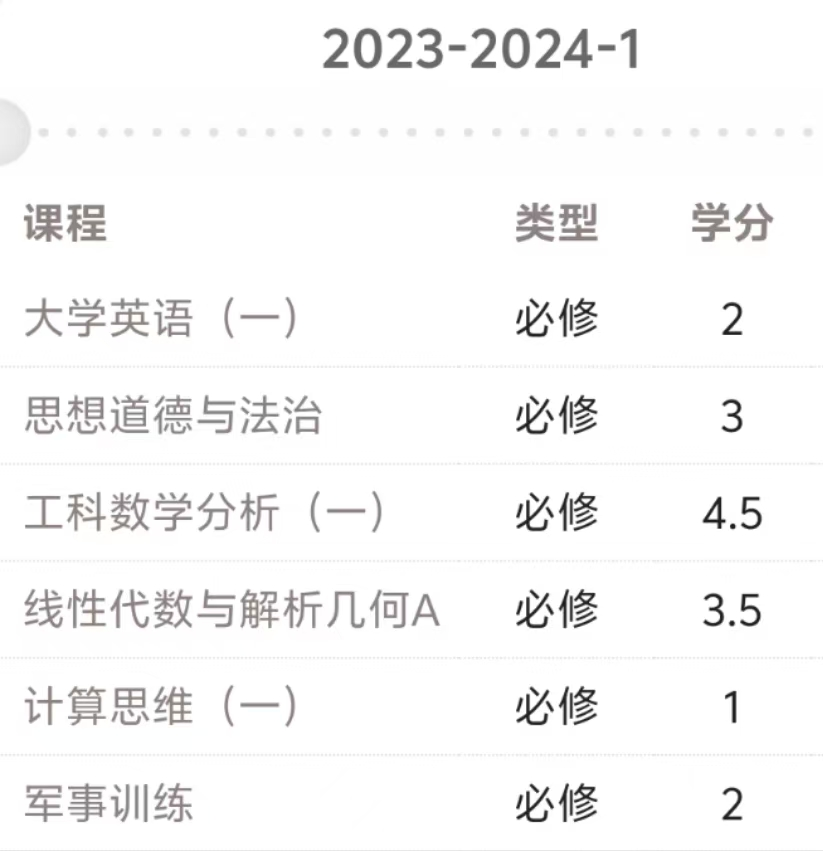

# **关于转专业**
 📣声明！ 
    我所介绍的是基于23级的转专业事宜，24级的政策可能会有所变化，更加权威详细的通知和要求请在学校发布的24级转专业通知中查阅（目前还未发布）！

 这两天有许多新生和家长在询问转专业的事宜，而我本人恰好也是从水声转专业到计算机的，也算是
 比较熟悉转专业事宜的。因此，我会尽可能详细介绍一下我们23级的转专业事宜。

 查看2023级转专业通知请点击：[2023级转专业通知](https://ugs.hrbeu.edu.cn/2024/0415/c2821a324106/page.htm)

## **转专业的学院要求**
 学校（据我了解的23级）遵循的是工科可以互转，文科可以互转的政策。 
 工科有：计算机，电子信息，自动化，水声工程，核工程，航空航天，机械（智能制造）。 
 文科有：大数据管理与应用，金融，工商管理，法学，英语。 
 24级的政策或许会有变化，请致电招生办或者到时候查看学校发布的24级转专业通知。

## **转专业科目要求**
 以下是我转专业时要求计入的科目，按照学分的比例进行加权平均。

  

## **转专业筛选法则**
 首先，学校会在转专业报名开始之前发布各个学院今年的转专业招收人数。（比如计算机准备招20人）

 然后，开始转专业报名。

 接下来，各个学院会通知你前往面试，给出你的面试分数。

 最后，各个学院会用 你的科目加权平均分+面试分数=总分，进行排名选择。（那么计算机就取前20名）

 注意！专业分流的时候（比如计算机有计科和信息安全两个专业），
 学院会公布分流的人数比例（比如计科80%，信息安全20%），
 转专业的学生的分流与原学院的学生的分流分开（原计算机学院自己排名），
 转专业的这些人里面排名，按照成绩排名高的先选择（这个我不清楚依照是转专业成绩还是科目加权成绩）。

## **转专业参考链接**
 第一个链接没有成绩，第二个，第三个链接有具体的分数。

 请点击：[2023级全校转专业拟录取名单](https://ugs.hrbeu.edu.cn/2024/0514/c12487a325267/page.htm)

 请点击：[2023级计算机学院转专业拟录取名单](https://cstc.hrbeu.edu.cn/2024/0426/c3688a324634/page.htm)
 
 请点击：[2023级水声工程学院转专业拟录取名单](https://uae.hrbeu.edu.cn/info/1058/4340.htm)

 
